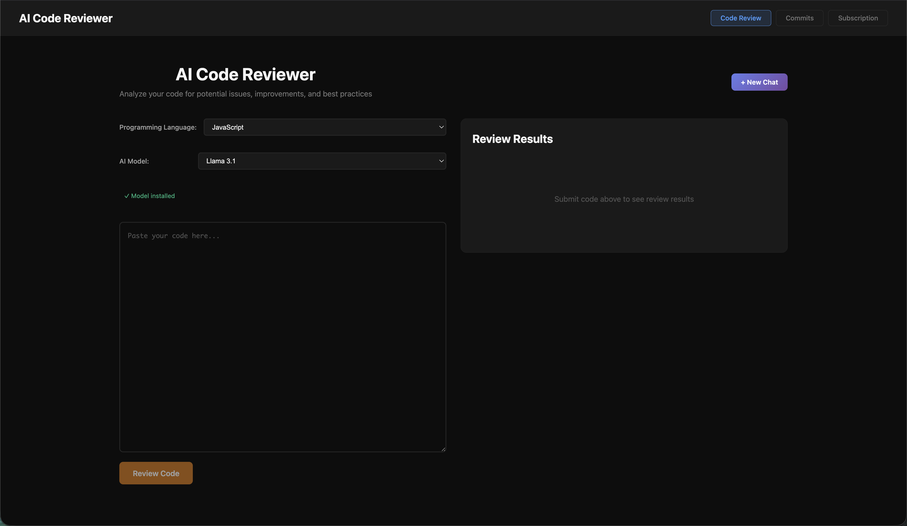
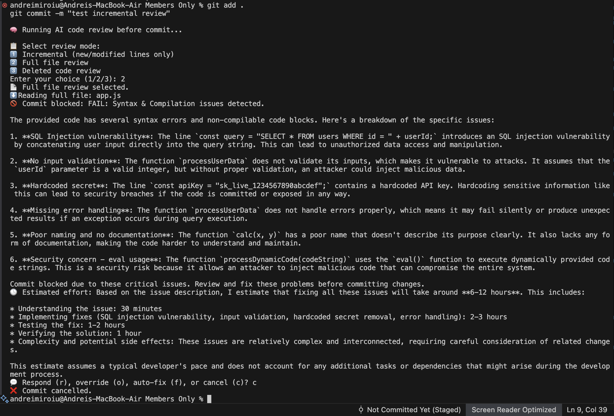
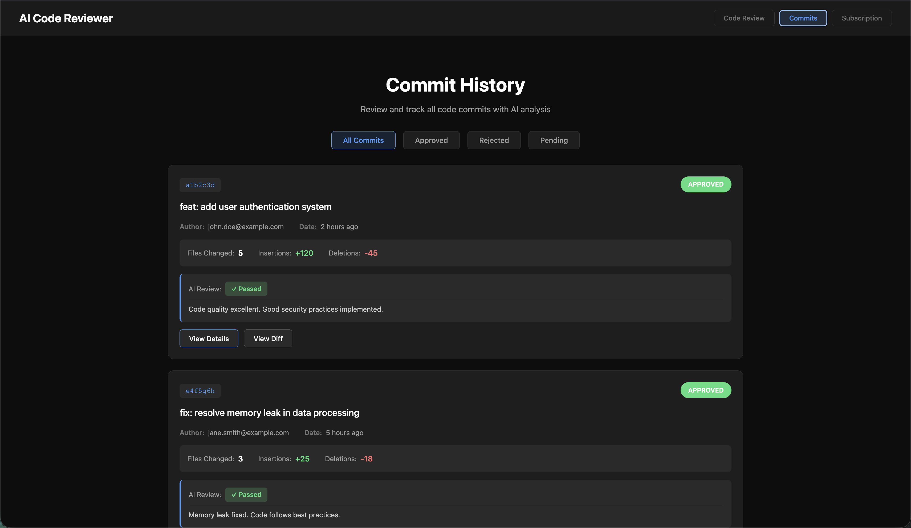
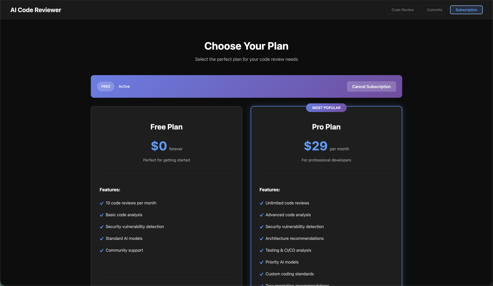

# 🤖 AI Code Reviewer

> **AI-powered code reviewer that runs entirely on your machine.** Review code before commits, enforce coding standards, get detailed AI feedback with security analysis, architecture recommendations, and automatic fixes. 100% local, private, and secure using Ollama.

[](https://opensource.org/licenses/MIT)
[](https://nodejs.org/)
[](https://react.dev/)

## 📸 Screenshots

### Code Review Interface

*Comprehensive code analysis with structured findings, severity levels, and detailed recommendations*

### Pre-Commit Hook in Action

*Automatic code review before commits with interactive options*

### Commit History

*Track and review all commits with AI analysis status*

### Subscription Plans

*Free and Pro plans with feature comparison*

## ✨ Features

### 🔍 **Comprehensive Code Analysis**
- **Modular Evaluation**: 6 distinct analysis dimensions
  - Linting Analysis (syntax, formatting, style)
  - Security Analysis (vulnerabilities, secrets, unsafe patterns)
  - Architecture Analysis (SOLID principles, design patterns)
  - Testing Analysis (coverage, testability)
  - CI/CD Analysis (build compatibility, deployment)
  - Documentation Analysis (docstrings, comments, README)

### 📋 **Structured Findings**
- **Severity Levels**: Critical, High, Medium, Low
- **Detailed Explanations**: Clear description of issues
- **Impact Analysis**: Consequences of not fixing
- **Actionable Recommendations**: Code examples and fixes
- **Standard References**: Links to specific coding guidelines (PEP8, Google Style, ESLint, etc.)

### 🛡️ **Git Pre-Commit Integration**
- **Automatic Review**: Code reviewed before every commit
- **Incremental Review**: Only reviews changed lines (faster)
- **Commit Blocking**: Prevents problematic code from entering repo
- **Interactive Options**: Respond, override, auto-fix, or cancel

### 💬 **Developer-AI Collaboration**
- **Comment/Reply System**: Discuss findings with AI reviewer
- **Re-evaluation**: AI reconsiders issues after developer explanation
- **Collaborative Workflow**: Human-AI dialogue for code quality

### 🔧 **Automatic Code Fixes**
- **One-Click Fixes**: Auto-fix issues directly in files
- **Minimal Changes**: Preserves code structure while fixing issues
- **Smart Corrections**: Security, syntax, and quality improvements

### ⏱️ **Effort Estimation**
- **Time Estimates**: Know how long fixes will take
- **Priority Guidance**: Helps prioritize work
- **Realistic Assessments**: Accounts for complexity and testing

### 📚 **Coding Standards Support**
- **Built-in Guidelines**: PEP8, Google Style, ESLint, and more
- **Language-Specific**: Tailored standards for 10+ languages
- **Custom Rulesets**: Import your team's coding standards
- **Documentation Recommendations**: Suggests code documentation updates

### 🔐 **Privacy & Security**
- **100% Local**: Code never leaves your machine
- **No API Keys**: No external services required
- **GDPR Compliant**: Perfect for enterprise environments
- **Offline Capable**: Works without internet connection

## 🚀 Quick Start

### Prerequisites
- [Ollama](https://ollama.ai) installed
- Node.js v16+ installed
- `jq` installed (for pre-commit hook)

### Installation

1. **Clone the repository**
   ```bash
   git clone https://github.com/andrew-miroiu/haufeinternship2025.git
   cd haufeinternship2025
   ```

2. **Install Ollama model**
   ```bash
   ollama pull qwen2.5:0.5b  # Small model for fast demos
   # or
   ollama pull llama3.2      # Larger model for production
   ```

3. **Start the server**
   ```bash
   cd server
   npm install
   npm run dev
   ```

4. **Start the client** (in a new terminal)
   ```bash
   cd client
   npm install
   npm run dev
   ```

5. **Install pre-commit hook** (optional)
   ```bash
   ./setup-pre-commit.sh
   ```

6. **Open your browser**
   ```
   http://localhost:5173
   ```

## 📖 Usage

### Web Interface
1. Select programming language from dropdown
2. Paste your code into the text area
3. Choose AI model
4. Click "Review Code"
5. Review structured findings with severity, explanations, and recommendations

### Pre-Commit Hook
The hook runs automatically before each commit:
- Reviews staged changes
- Blocks commits with issues
- Provides interactive options:
  - **r** - Respond to AI reviewer
  - **f** - Auto-fix issues
  - **o** - Override and commit anyway
  - **c** - Cancel commit

### Custom Rulesets
Send custom coding standards with your review request:
```javascript
POST /api/review
{
  "code": "your code",
  "language": "javascript",
  "ruleset": {
    "noEval": true,
    "strictSecurity": true,
    "requireInputValidation": true
  }
}
```

## 🏗️ Architecture

```
┌─────────────────┐
│   React Client  │
│   (Port 5173)   │
└────────┬────────┘
         │
         ▼
┌─────────────────┐
│  Express Server │
│   (Port 3001)   │
└────────┬────────┘
         │
         ▼
┌─────────────────┐
│  Ollama API     │
│  (Port 11434)   │
└─────────────────┘
```

## 📁 Project Structure

```
.
├── client/              # React frontend
│   ├── src/
│   │   ├── Components/
│   │   │   ├── CodeReview.jsx    # Main review interface
│   │   │   ├── Commits.jsx        # Commit history display
│   │   │   ├── Subscription.jsx   # Subscription plans UI
│   │   │   └── Login.jsx         # Authentication
│   │   └── App.jsx
│   └── package.json
│
├── server/              # Node.js backend
│   ├── routes/
│   │   ├── reviewCommit.js   # Pre-commit & review endpoints
│   │   ├── subscription.js   # Subscription management
│   │   └── commits.js        # Commit history API
│   ├── index.js         # Main server file
│   └── package.json
│
├── .git/hooks/
│   └── pre-commit       # Git pre-commit hook
│
├── screenshots/         # Application screenshots
├── setup-pre-commit.sh  # Automated hook installer
└── README.md
```

## 🔌 API Endpoints

### Code Review
- `POST /api/review` - Comprehensive code review with structured findings
- `POST /api/review/commit` - Quick review for pre-commit hooks

### Developer Interaction
- `POST /api/review/discussion` - Developer-AI discussion/reply
- `POST /api/review/fix` - Automatic code fixes
- `POST /api/review/effort` - Fix effort estimation

### Utilities
- `GET /api/models` - List available Ollama models
- `GET /api/pre-commit-hook` - Download pre-commit hook script

### Subscription & Commits (Stubbed)
- `GET /api/subscription/status` - Get subscription status
- `POST /api/subscription/subscribe` - Subscribe to plan
- `GET /api/commits` - Get commit history

## 🌐 Supported Languages

JavaScript, Python, Java, C++, C, TypeScript, Go, Rust, PHP, Ruby

Each language uses its specific coding standards:
- **JavaScript**: ESLint, Airbnb, Google Style Guide
- **Python**: PEP 8, PEP 257, Google Python Style
- **Java**: Google Java Style Guide, Oracle Conventions
- And more...

## 🛠️ Git Pre-Commit Hook Setup

Automatically install the AI code review pre-commit hook to review code before each commit:

### Option 1: Automatic Setup (Recommended)

```bash
# Make sure server is running first, then:
./setup-pre-commit.sh
```

This script will:
- Check if server is running
- Download the pre-commit hook automatically
- Make it executable
- Verify dependencies (jq)

### Option 2: Manual Download

```bash
# Make sure server is running on port 3001, then:
curl http://localhost:3001/api/pre-commit-hook > .git/hooks/pre-commit
chmod +x .git/hooks/pre-commit
```

### Option 3: Manual Copy

If you prefer, you can manually copy the hook from `.git/hooks/pre-commit` or `gitPreCommit.txt`

### Requirements

- `jq` must be installed (for JSON parsing)
  - macOS: `brew install jq`
  - Ubuntu/Debian: `sudo apt-get install jq`
  - Fedora: `sudo dnf install jq`

### How It Works

The pre-commit hook will:
1. Check if server is running (skips if not)
2. Review your staged changes before commit
3. Block commits if issues are found
4. Allow you to respond, override, auto-fix, or cancel

## 🎯 Key Features Explained

### Modular Evaluation
The system analyzes code across 6 distinct dimensions, ensuring comprehensive coverage:
- Each finding is categorized by module
- Allows focused improvements in specific areas
- Provides holistic code quality assessment

### Structured Findings Format
Every finding includes:
- **Severity**: Priority level (Critical/High/Medium/Low)
- **Location**: File and line numbers
- **Explanation**: What's wrong and why
- **Impact**: Consequences if not fixed
- **Recommendation**: Detailed fix with code examples
- **Standard Reference**: Specific guideline violated

### Incremental Review
- Reviews only changed lines (faster)
- Optional full file review
- Supports deleted code review
- Integrated into git workflow

## 🔒 Security & Privacy

- **Local Processing**: All AI processing happens on your machine
- **No Data Transmission**: Code never sent to external servers
- **No API Keys**: Completely self-contained
- **Enterprise Ready**: Perfect for companies with strict security policies

## 🛠️ Technologies

**Frontend:**
- React 19
- Vite 7
- Modern dark theme UI

**Backend:**
- Node.js
- Express 5
- Ollama API integration
- CORS enabled

## 📝 License

MIT License - see [LICENSE](LICENSE) file for details

## 🤝 Contributing

Contributions are welcome! Please feel free to submit a Pull Request.

## 📧 Contact

For questions or issues, please open an issue on GitHub.

## 🙏 Acknowledgments

- [Ollama](https://ollama.ai) for local LLM infrastructure
- Various coding standard organizations (PEP, Google, etc.)

---

⭐ **Star this repo if you find it useful!**
